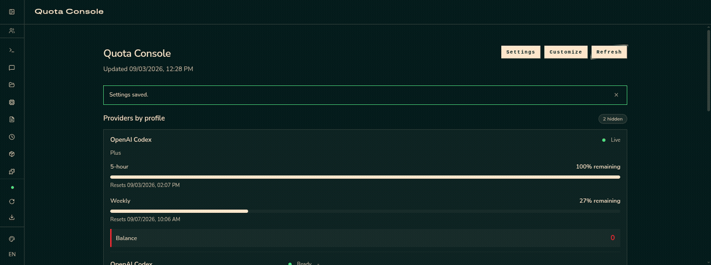

# Hermes Quota Console

[](https://github.com/semihkiroglu/hermes-quota-console/actions/workflows/ci.yml)
[](https://github.com/semihkiroglu/hermes-quota-console/tags)
[](LICENSE)
[](pyproject.toml)
[](https://github.com/NousResearch/hermes-agent)

A **provider quota/balance dashboard plugin** for Hermes Agent: shows the
providers your profiles use, their selected models, and usage state on one
tab.



## Features

- **Provider-by-profile view** — each provider card shows the quota/balance
  summary, the profiles using that provider, and each profile's state on that
  provider (ok / rate-limited / degraded / auth failed)
- **Profile discovery** — all profiles defined in Hermes and their selected
  models are listed automatically
- **Alert thresholds** — global defaults configured in Settings, overridable
  per provider: low remaining percentage, low balance, and zero-balance
  alerts. Thresholds are off by default
- **Card layout customization** — hide, show, and drag-to-reorder cards in
  Customize mode; preferences are stored in the browser
- **Browser notifications (opt-in)** — receive a native browser
  notification when a critical (out of quota / rate-limited / auth
  failed) or low (running low) alert lands while the dashboard tab is
  open or in the background. Per-alert dedupe, an opt-in repeat
  reminder, and a permission gate; off by default
- **Row-level reset** — the button shown when Hermes blocks usage
  (rate-limited/degraded) lifts the block so you can continue; it never
  touches credentials
- **Server-side credentials** — tokens stay in Hermes; only summary data goes
  to the browser

## Supported providers

| Provider | Plan quota | Balance/credits |
|---|---|---|
| DeepSeek | ❌ | ✅ |
| MiniMax | ✅ | ✅ |
| OpenAI Codex | ✅ | ✅ |

- Other Hermes providers (e.g. Copilot, OpenCode Free) appear as
  profile/model rows; quota/balance is only shown for the adapters above.
- Providers not bound to any profile (no credentials) in Hermes never appear
  on the panel.
- The provider list is code-based — guide for adding a provider:
  [docs/ADDING_A_PROVIDER.md](docs/ADDING_A_PROVIDER.md).
- Legend:
  - ✅ available in the provider and in the plugin
  - 🟡 available in the provider but not in the plugin
  - ❌ not available in the provider

## Install & update

Install:

```bash
git clone -b stable https://github.com/semihkiroglu/hermes-quota-console.git ~/.hermes/plugins/quota-console
```

The `stable` branch is the release line (the repository default is
`unstable`, where development happens). Update (existing checkout):

```bash
cd ~/.hermes/plugins/quota-console
git pull --ff-only
```

Then restart the Hermes dashboard process. The `/quota-console` route and
**Quota Console** tab appear in the dashboard.

> Plugin id and route: `quota-console`. Settings storage:
> `<hermes-home>/plugin-data/quota-console/config.json`.

## Usage

- **Cards**: each provider card shows the quota/balance summary, the profiles
  using it, and their states. Credential problems like auth failed show up as
  a state on the card.
- **Status banners**: providers reporting low quota, exhausted balance, or a
  usage block (rate-limited/degraded) are summarized in yellow/red banners at
  the top.
- **Global alert strip**: while the dashboard is open, a full-width strip
  below the top nav (on any page) appears when a provider needs attention —
  low/exhausted quota, a Hermes usage block (rate-limited/degraded), or an
  auth failure. It polls the same 30s-cached summary every 60s and links into
  this page. Transient "unavailable" fetch failures never raise the strip.
- **Version**: the footer shows the plugin version (`v0.2.1`) read from
  `pyproject.toml`, matching the GitHub release tag.
- **Settings**: alert thresholds are configured in two layers — global
  defaults first, then per-provider overrides. No alerts fire until a
  threshold is set. The Settings dialog opens with a "Notifications"
  section: master toggle, alert levels (`critical` / `low`), an opt-in
  "Remind me again" switch with a 5..1440-minute cadence, and a
  permission gate that only asks for the browser permission when you
  click "Enable browser notifications". The pill re-reads the live
  permission on focus / tab visibility — no manual Refresh button.
- **Notifications**: configured in Settings and rendered with the
  browser's `Notification` API while the dashboard tab is open or
  in the background. The check piggy-backs on the 60-second summary
  poll: a new alert (a critical exhaustion, a provider rate-limited by
  Hermes, an auth failure, etc.) fires a notification the first time it
  shows up; the per-alert dedupe keeps repeats quiet until either the
  identity leaves the snapshot or, when "Remind me again" is on, the
  configured minutes have passed. The click handler focuses the
  dashboard tab without reloading the page, and the per-alert dedupe
  memory survives an F5 via sessionStorage so a reload can never
  re-fire an already-notified alert. **Tab-closed delivery is not
  supported in this version.** Closing the tab silences notifications;
  alerts still surface inside the dashboard on the next visit.
- **Customize**: hide/show cards and drag-to-reorder mode. Hidden cards show
  as compact rows in this mode only and return with one click.
- **Reset**: "Reset usage" on a profile row appears only when Hermes blocked
  usage (rate-limited/degraded) and lifts the block. It never touches
  credentials.

## Security

Security model and vulnerability reporting: [SECURITY.md](SECURITY.md).

## Support

Plugin issues and upstream Hermes Agent questions:
[SUPPORT.md](SUPPORT.md).

## Development

Contribution process, environment setup, and pre-PR gate:
[CONTRIBUTING.md](CONTRIBUTING.md).

## License

Licensed under the [Apache License 2.0](LICENSE).
